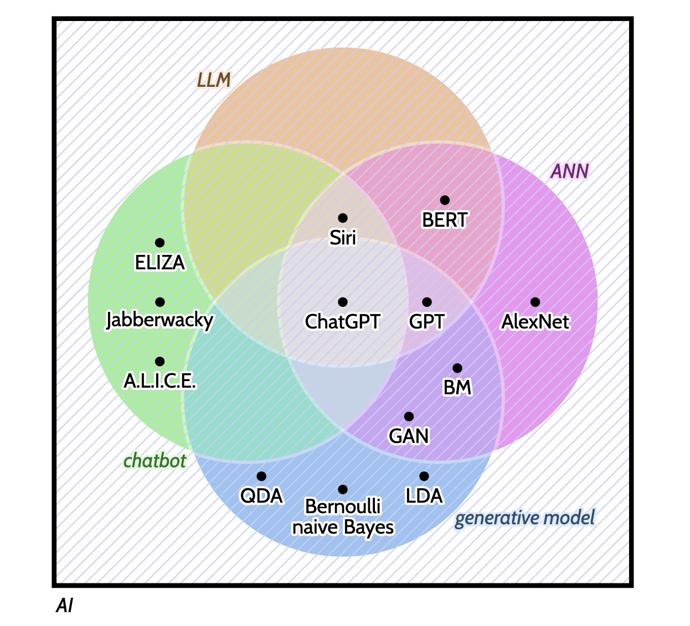

# What are *Critical AI Literacies*?

- Critical AI Literacies (CAILs) are about *thinking critically* about AI products, histories, and ecosystems 
- Plural Literac**ies** as they involve different theoretical and practical perspectives on AI
- CAILs concern the knowledge necessary to going beyond the question of *how to use AI* to *when, where and why to use it, and importantly, when NOT to use it*, empowering students (and teachers) to become active decision-makers rather than passive consumers
- ''CAILs centre human cognition and uphold the integrity of academic research and education.'' [@guestsuarezrooij2025], focusing on technical, cognitive, societal and environmental evidence rather than following the promises put forward by the technology industry
- Knowledge to `` tell apart nonsense hype from true theoretical computer scientific claims'' (Olivia Guest, https://olivia.science/ai/)

# Focus of this collection

**{chatbots + LLM + generative + ANN}** 

AI is a vague term which encompasses many different types of models and applications. Here, we focus on what is often referred to as *generative AI*, involving large language models (LLMs) built with Artificial Neural Networks (ANNs) and implemented through chatbot interfaces. 

A cartoon set theoretic view on various terms (see Table 1) used when discussing the superset AI

# How to use this collection of information

Structure and how to use

# Prerequisites

You should have already acquired a basic knowledge of AI, for example through completing the "Edulabs KI Crashkurs" offered by the University of Cologne (only available in German). 
Regarding, introductions to AI in English, we recommend [The Bullshit Machines](https://thebullshitmachines.com/).

More concretely, you should be familiar with the following concepts: 

1. the difference between deterministic and probabilistic models. 
2. LLMs, chatbots, and combination of both (ChatGPT is not equal to LLM)
3.

# Ideas 

- starting off a conversation about AI with students
  - Kahoot
  - Padlets
  - 
- forums for before-class preparation

