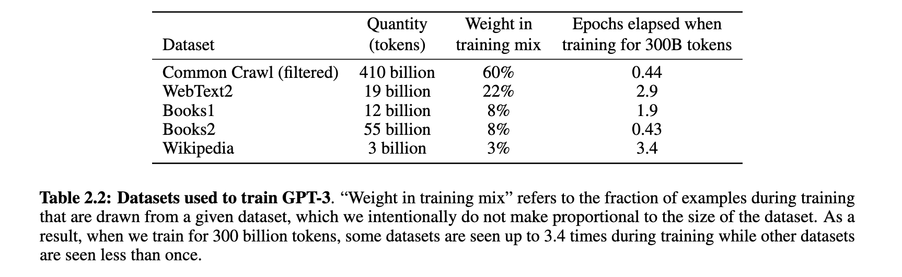

-------------------

### Overview

-
-

-------------------

# Content

## Training input

- The training of LLMs involves modelling the probabilistic relationship between words of vast amounts of texts
- These texts are usually "scraped" from the internet 
  - *web scraping*: technique to automatically download and process web content
- For instance, these datasets were reported by OpenAI to make up the training data for GPT-3:
  - Common Crawl (filtered): data collected over more than 13 years of web crawling 
  - WebText2: webpages referred to from Reddit posts with three or more upvotes 
  - Wikipedia: we all know this :-) 
  - Books1 and Book2: internet-based books corpora ([unclear what these actually include!]{style="color:red;"})

- although see: articles on AI companies buying second hand books 

::: {.callout-note title="Task ideas"}
- 
:::

::: {.callout-tip title="Discussion questions"}
- What does internet data consist of? 
- Do you think that this kind of data reflects (all of) human culture, cognition and 
- What do you think may be possible consequences of training models on vast amount of text whose content is unknown to us? 
:::

::: {.callout-warning title="For linguistic students"}
- What is not in the training input that characterises language?
:::

## Reinforcement Learning from Human Feedback

- Based on this training input alone, GenAI chatbots would not be as eloquent as they are portrayed to be (see [Interaction](../../_site/topics/interaction/interaction.html)). 
- And additionally, such models would produce inappopriate, offensive, violent and sexual content (because of areas of the web that we (probably) don't frequent...)
  - As OpenAi themselves put it: "These models are not aligned with their users." [abstract, @ouyang2022traininglanguagemodelsfollow]
-  Making LLMs adhere to certain rules and preferences and fulfil certain functions is called *Alignment*
- In GenAI chatbots, this a technique called *Reinforcement learning from Human Feedback (RLHF)* is applied
  - *RLHF* is a technique to incorporate human information to, for instance, LLMs
  -  There are different ways to do that, but the basic idea is the following (https://intuitionlabs.ai/articles/reinforcement-learning-human-feedback):
    - choose different prompts or environments. (for instance, real user queries or tasks from a prompt dataset)
    - for each prompt, get multiple responses from current model
    - human annotators rank these responses, following certain instructions
  - for a longer, but still relatively accessible explanation of RLHF see [huggingface's post](https://huggingface.co/blog/rlhf)

[An interface that annotators use to evaluate model output for Anthropic [@bai2022traininghelpfulharmlessassistant]](../../images/anthropic_interface.png)

Who are the annotators?

- crowdworkers (also called *gig workers*, *platform workers* or *data workers*), maybe more added in another topic (hegemonic,...)
  - Casilli et al. 

## Information in the Model Output: Bias, Stereotypes, Political Views,...

- The GenAI chatbot's output depends on:
  1. the training data of the LLM
  2. manually annotated and evaluated datasets, which in turn, depend on instructions given to annotators
- As a consequence: 
  - these tools are not *neutral* (as they are often claimed to be)
  - companies can influence what models produce by designing their guidelines accordingly
  - see article on....
  - Buyl et al. 

- Importantly, they also exhibit biases and stereotypes

- misleading health information: https://www.theguardian.com/technology/2026/jan/02/google-ai-overviews-risk-harm-misleading-health-information

## Plagiarism

LD: p.10
LD: p.13

# Slides

[Link to slides]()

# Comprehension questions

- https://www.soekia.ch/gpt.html
-
-

# Further links

- https://www.nytimes.com/2026/08/20/world/asia/ai-jobs-data-annotation-india-karur.html

# References

::: {#refs}
:::

